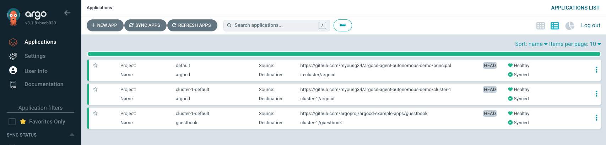

## README

* Im using DO k8s, but any two clusters that can talk to each other will work
  * I use two contexts: `do-atl1-k8s-1-33-1-principal` and `do-atl1-k8s-1-33-1-cluster-1` (the workload)
* `cd principal && kustomize build | kubectl apply -f - --context do-atl1-k8s-1-33-1-principal`
* Run `kustomize build | kubectl apply -f - --context do-atl1-k8s-1-33-1-principal` again since app.yaml failed without the CRDs yet
* Wait for your UI to come up and valid, wait for the agent service load balancer to have a valid IP. Argo manages itself, so it should show healthy and synced
* Wait for all pods *except* the agent to come up. it will stay in failed until you run the next line to set up the CA/Certs/JWT
* `bash after.sh`
* Check that the agent pod is good to go and not erroring
* `cd ../cluster-1` and comment out `app.yaml` from `kustomization.yaml` as that has to come last (for argo to manage itself)
* `kustomize build | kubectl apply -f - --context do-atl1-k8s-1-33-1-cluster-1`
* Wait until all pods (except the agent) are healthy
* `bash after.sh`
* check the agent pod to go healthy and be able to talk to the principal
  * `k get appprojects -A --context do-atl1-k8s-1-33-1-cluster-1` -> should show `default`
  * `k get appprojects -A --context do-atl1-k8s-1-33-1-principal` -> should show `cluster-1-default`
* `k -n argocd --context do-atl1-k8s-1-33-1-cluster-1 apply -f app.yaml`
* the principal UI should show cluster-1/guestbook and cluster-1/argocd now and they should show healthy and synced. Both argo's manage themselves now
